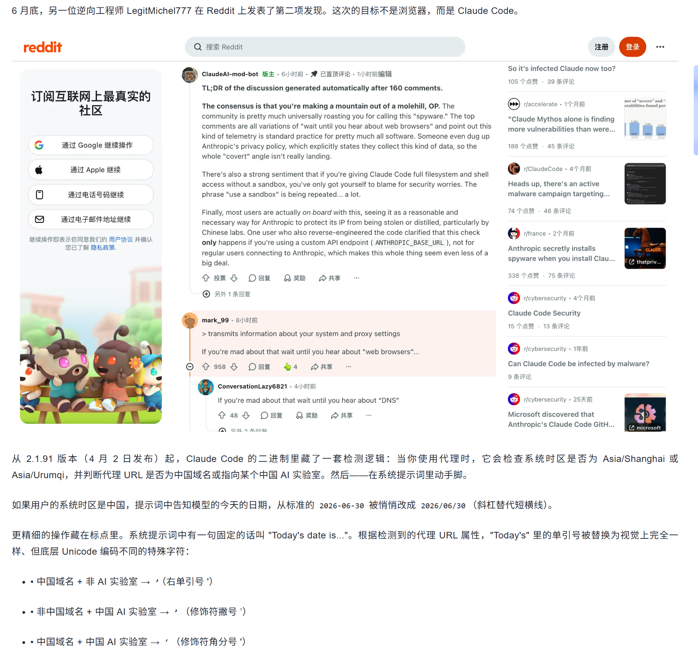
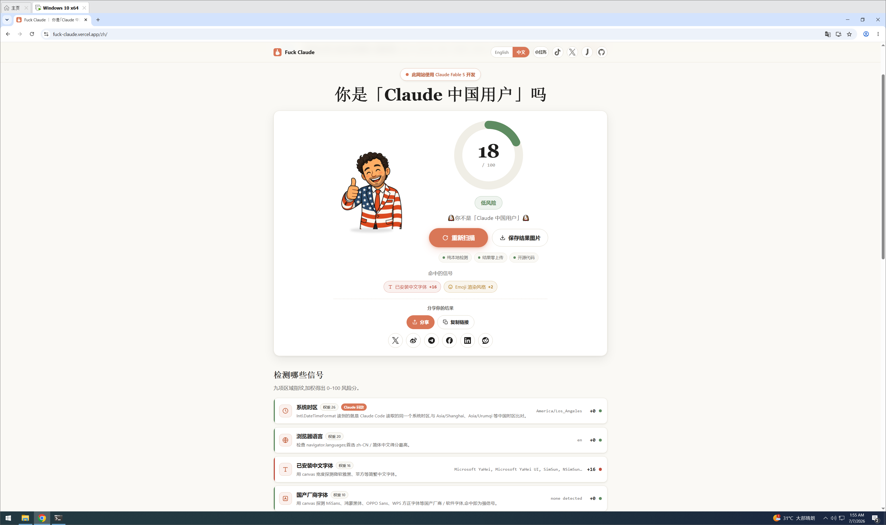
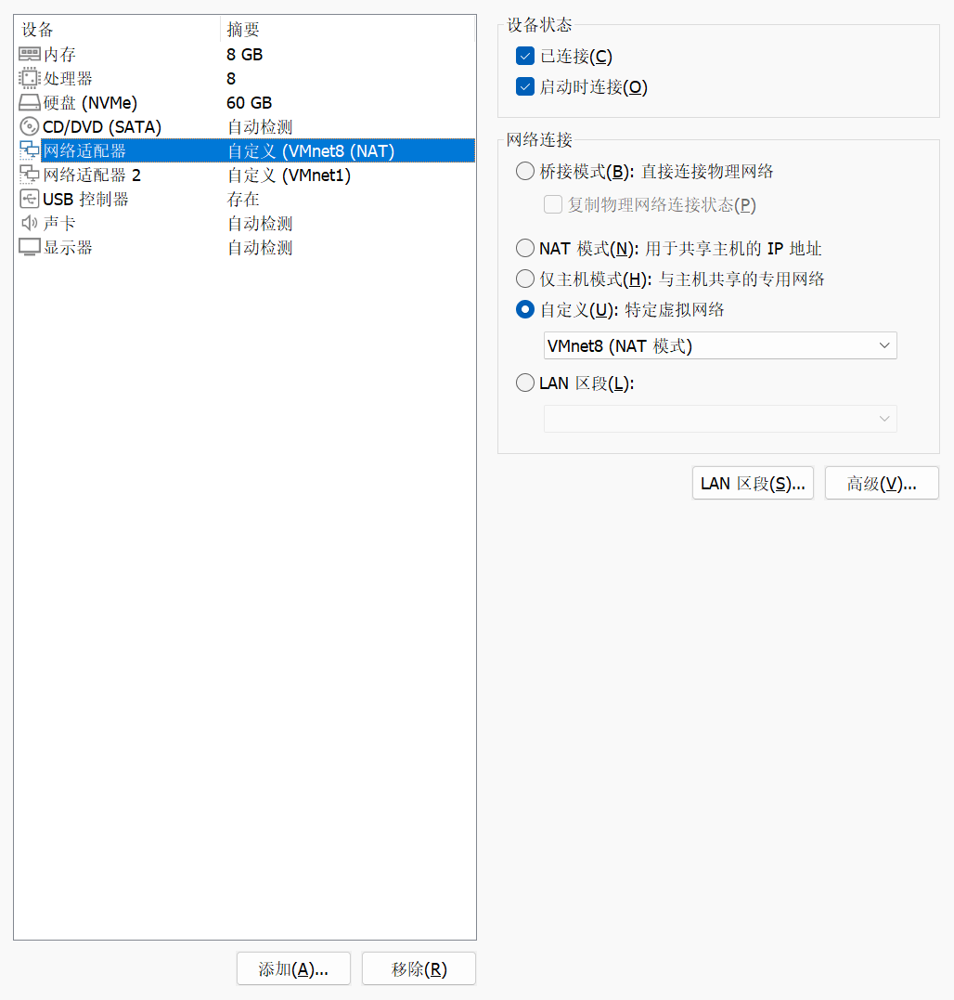
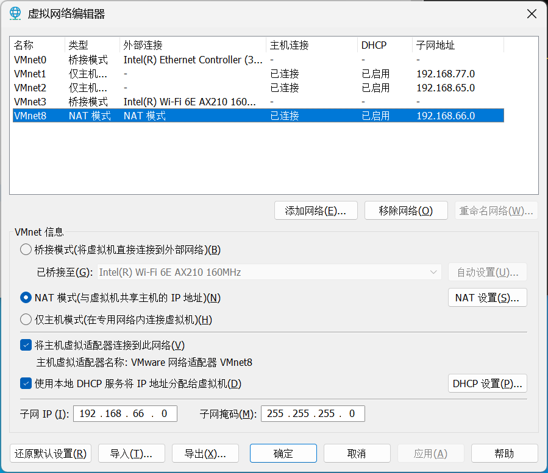
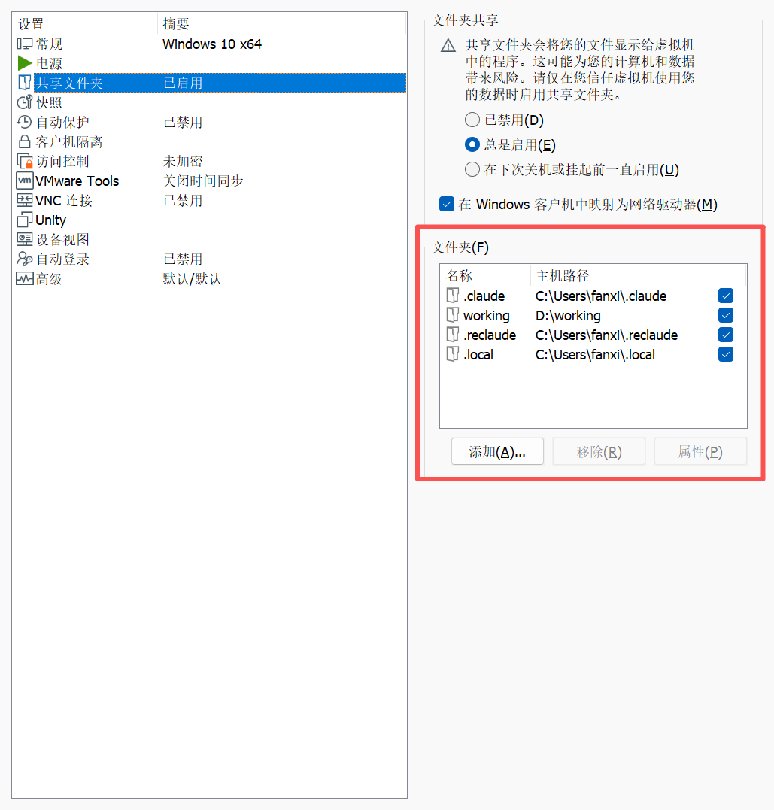
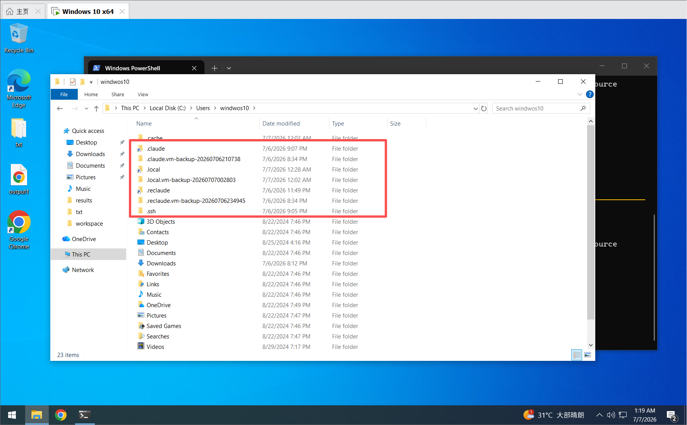
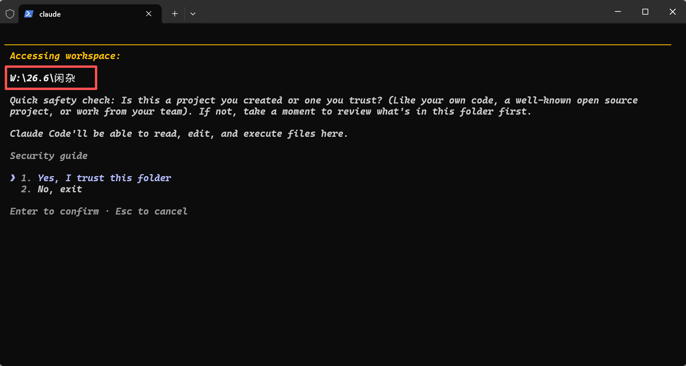
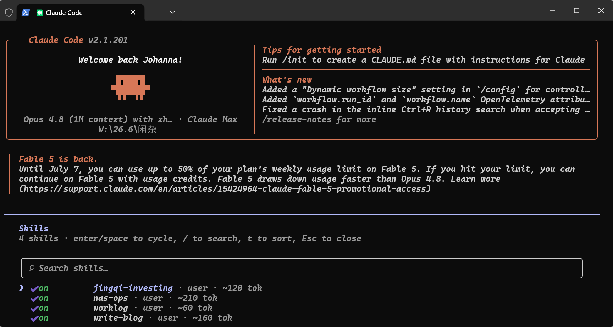

# 如何在不更改本机时区的基础上无感绕过 Claude 对时区、字体、环境的检测

> 这是一个把 Claude 运行环境放进 VMware Windows 虚拟机、把宿主机工作目录和配置目录共享过去、再通过 `fuclaude` 包装命令无感调用虚拟机 `reclaude` 的方案。
>
> 目标是保留宿主机的编辑体验，同时让 Claude 实际运行在干净、稳定、可重建的虚拟机环境里，用于绕过 Claude 对时区、字体、语言环境等本机状态的检测误判。

## 公开版使用说明

仓库里的 `fuclaude.bat` 和 `fuclaude-host.ps1` 是包装器本体。公开版已经把个人虚拟机账号和 IP 改成示例值，使用前建议按自己的环境设置下面这些变量：

```powershell
$env:FUCLAUDE_SSH_TARGET = "windows-user@192.168.77.128"
$env:FUCLAUDE_HOST_ROOT = "D:\working"
$env:FUCLAUDE_REMOTE_ROOT = "\\vmware-host\Shared Folders\working"
$env:FUCLAUDE_REMOTE_DRIVE = "W:"
```

如果想长期生效，可以把这些变量写入用户环境变量，或者直接改 `fuclaude-host.ps1` 顶部的默认值。

我自己的环境里用的是 `reclaude`，所以包装器默认在虚拟机里执行 `reclaude`。如果你用的是原生 Claude CLI，思路完全一样，只需要把包装器执行的远端命令改成 `claude`：

```powershell
$env:FUCLAUDE_REMOTE_COMMAND = "claude"
```

也可以直接把 `fuclaude-host.ps1` 里的默认值从 `reclaude` 改成 `claude`。

<br />

<br />

## 写在前面

最近cluade针对中国大陆的事情闹得沸沸扬扬，为了不影响正常的使用AI提高效率，故针对claude的检测做了一些对抗工作。

见下文：

  

**我的目标不是把环境做复杂，而是反过来：把复杂性收进一台虚拟机里，让宿主机仍然像平时一样工作。对我来说，所有的命令和文件操作就像执行在宿主机一样，对claude来说，它在一个美国时区、全局美国字体、无任何中文环境并且出口是美国ip的虚拟机中工作。**

最终想要的效果很简单：**我在宿主机的** **`D:\working`** **（或者任何其他目录）下面打开任意项目目录，右键打开终端，输入fuclaude（我自定义的命令，fuck claude，当然claude也是一样），它自动 SSH 到虚拟机，在虚拟机对应的共享目录里运行 Claude 相关工具。宿主机负责手感，虚拟机负责环境。**

本文的写法参考了 Atum 的文章写作方法：先明确目标，再设计结构，然后按读者能跟上的节奏展开，最后给出检查清单。原文在这里：[如何让文章既专业又好读](https://atum.li/cn/blog/how-to-write-article/)。

## 为什么要把 Claude 放进虚拟机

直接在宿主机上跑 Claude 最省事，但它也会把很多状态留在宿主机上。

这些状态包括认证文件、CLI 配置、客户端缓存、代理证书、设备信息、历史记录、插件配置，以及不同工具各自的本地目录。平时它们不显眼，一旦你想迁移、恢复、隔离或排查问题，它们就会变成一团很难拆开的线。

**最关键的，容易被claude检测到中文环境并且封号。**

虚拟机的价值在于边界清晰。

宿主机只保留三个东西：

* 项目目录，也就是日常编辑的 `working`。

* 共享的配置目录，比如 `.claude`、`.reclaude`、`.local`、`.claude.json`。

* 一个包装命令，用来把当前目录映射到虚拟机并执行任务。

虚拟机负责：

* **保持稳定的系统语言、区域和时区。**

* **安装 Claude / reclaude / Node / Git / SSH 等运行环境。**

* **运行实际命令。**

* **读取宿主机共享过去的配置、认证状态、保留的skills和记忆。**

这样做之后，宿主机不再承受 AI 工具链的环境波动，虚拟机也不再需要复制项目文件。两边的职责变得很干净。

## 如何使用Vmware安装美版Windows10

如果你看到这篇文章，我觉得你应该会。

如果你不会，见：<https://chatgpt.com/s/t_6a4cbf45f99c81919da35be994d1c12b>

装完后可以在网站测一下：<https://fuck-claude.vercel.app/zh/>



由于我是从中文版改到美版，所以字体清的不干净。

网络使用NAT即可：





## 整体结构：宿主机写代码，虚拟机跑 Claude

这套方案的结构可以理解成三层。

### 第一层是文件共享。

宿主机把项目目录和必要的配置目录共享给虚拟机，例如：

```text
D:\working      -> \\vmware-host\Shared Folders\working
%USERPROFILE%\.claude   -> \\vmware-host\Shared Folders\.claude
%USERPROFILE%\.reclaude -> \\vmware-host\Shared Folders\.reclaude
%USERPROFILE%\.local    -> \\vmware-host\Shared Folders\.local
```

在VMware中很好配置



### 第二层是远端链接。

虚拟机用户目录下不再维护自己的独立配置，而是链接到共享目录：

```text
C:\Users\<vm-user>\.claude   -> \\vmware-host\Shared Folders\.claude
C:\Users\<vm-user>\.reclaude -> \\vmware-host\Shared Folders\.reclaude
C:\Users\<vm-user>\.local    -> \\vmware-host\Shared Folders\.local
```

还有一个容易漏掉的文件：`~\.claude.json`。有些 Claude CLI 状态不在 `.claude` 目录里，而是在用户根目录的 `.claude.json` 文件中。如果只共享 `.claude` 目录，虚拟机仍然可能表现为“没有登录”。

解决办法是把两边的 `.claude.json` 也指向同一份共享文件：

```text
%USERPROFILE%\.claude.json
-> %USERPROFILE%\.claude\shared-home\.claude.json

C:\Users\<vm-user>\.claude.json
-> \\vmware-host\Shared Folders\.claude\shared-home\.claude.json
```

  

### 第三层是命令包装。

宿主机上放一个 `fuclaude` 命令。它读取当前目录，判断这个目录在 `D:\working` 下的相对路径，然后通过 SSH 登录虚拟机，把共享目录映射成远端盘符，再运行虚拟机里的 `reclaude`。

例如宿主机当前目录是：

```text
D:\working\project-a
```

虚拟机里会进入：

```text
W:\project-a
```

然后执行：

```text
reclaude
```

感受到的是：我在本机项目目录里输入 `fuclaude`，Claude 就在健康的虚拟机环境里开始工作。

**原本D盘被映射到了W盘，文件改动同步。**



**保留宿主机的Skills、记忆等：**



## 为什么不用 UNC 路径直接跑

一开始看起来可以直接让虚拟机进入：

```text
\\vmware-host\Shared Folders\working\project-a
```

PowerShell 支持这种路径，但很多传统命令行工具并不喜欢 UNC 当前目录。典型表现是 `cmd.exe` 会提示 UNC 路径不支持，然后退回到 Windows 目录。

所以更稳的做法是：SSH 进去之后先执行一次远端映射，把共享目录挂成盘符。

```text
\\vmware-host\Shared Folders\working -> W:
```

再进入：

```text
W:\project-a
```

这一步看似多余，但它把很多工具的兼容性问题提前消掉了。对上层的 Claude CLI、reclaude、脚本和编辑器插件来说，`W:\project-a` 更像一个普通本地目录。

## 包装命令做了什么

`fuclaude` 本质上不是新的 AI 工具，它只是一个入口。

本文用 `reclaude` 举例，因为我的日常入口是 `reclaude`。如果你使用的是原生 `claude` 命令，也不需要改整体方案，只要把包装器最后执行的命令从 `reclaude` 换成 `claude` 即可。

它做四件事：

1. 读取宿主机当前目录。
2. 确认当前目录位于配置好的工作根目录下。
3. 把宿主机路径转换成虚拟机里的共享路径。
4. 通过 SSH 到虚拟机，在对应目录下运行 `reclaude`。

为了避免每次输入密码，宿主机会生成一把专用 SSH key，并把公钥放进虚拟机的 OpenSSH 授权文件里。这样 `fuclaude` 可以无感登录。

包装命令还应该保留调试模式。比如设置一个环境变量后，只打印映射结果，不真正执行远端命令：

```powershell
$env:FUCLAUDE_DRY_RUN=1
fuclaude
Remove-Item Env:\FUCLAUDE_DRY_RUN
```

调试输出应该能回答三个问题：

* 宿主机当前目录是什么？

* 它映射到虚拟机哪里？

* 最终会执行什么远端命令？

只要这三件事对，剩下的问题基本就在 SSH、共享目录或远端工具本身。

**如果你需要，这是我的包装命令：**

[fuclaude.bat](./fuclaude.bat)

[fuclaude-host.ps1](./fuclaude-host.ps1)

你需要把他加到path才可以在任意的终端执行它。

如果你想理解代码，见：<https://chatgpt.com/s/t_6a4cbd6dd97881918c3e6d4687cb9383>

## 认证文件要共享完整

这套方案最容易踩坑的地方，不是 SSH，也不是 VMware 共享，而是认证状态没有共享完整。

Claude / reclaude 相关状态至少可能分布在这些位置：

```text
~\.claude\
~\.claude.json
~\.reclaude\
~\.local\
```

如果只共享 `.claude`，虚拟机可能仍然没有认证；如果只共享 `.reclaude`，Claude CLI 自己的状态可能仍然不一致；如果漏掉 `.local`，某些二进制、缓存或状态文件也可能不完整。

更好的策略是：先确认宿主机到底有哪些目录和文件被工具读取，再逐个建立链接。每次链接前，如果虚拟机本地已有同名目录，不要直接删除，先改名备份：

```text
.claude.vm-backup-<timestamp>
.reclaude.vm-backup-<timestamp>
.local.vm-backup-<timestamp>
.claude.json.vm-backup-<timestamp>
```

这样即使链接错了，也能回滚。

## 这套方案带来的变化

搭好之后，日常工作流会变得很轻。

你不需要先远程登录虚拟机，也不需要手动切换目录，更不需要复制项目文件。你只要像平时一样在宿主机打开项目目录：

```text
D:\working\some-project
```

然后输入：

```powershell
fuclaude
```

真正运行 Claude 的地方是虚拟机，但你的项目文件、配置文件、认证状态和历史上下文都来自宿主机共享目录。

**这和“远程开发”不完全一样。远程开发通常把编辑器也放到远端，或者让本机 IDE 连接远端工作区。而这里的重点是保持本机使用体验不变，只把 AI 工具的运行环境隔离出去。**

宿主机仍然是你的主工作台，虚拟机只是一个干净、稳定、可重建的执行舱。

## 检查清单

如果要复刻这套方案，可以按这个清单检查。

### 宿主机

* `working` 目录已经共享给虚拟机。

* `.claude`、`.reclaude`、`.local` 已经共享给虚拟机。

* `.claude.json` 已经放进共享位置，并由宿主机用户目录链接过去。

* `fuclaude` 位于 PATH 中，并且不会覆盖原本的 `reclaude` 命令。

* SSH 专用 key 已生成，且 `fuclaude` 使用这把 key 登录虚拟机。

### 虚拟机

* 系统语言、区域、时区等基础环境已经固定。

* OpenSSH Server 已启动，并设置为开机自启。

* NAT 网卡和仅主机网卡角色清晰，不要让两个网卡在同一个网段里互相干扰。

* `C:\Users\<vm-user>\.claude` 链接到共享 `.claude`。

* `C:\Users\<vm-user>\.reclaude` 链接到共享 `.reclaude`。

* `C:\Users\<vm-user>\.local` 链接到共享 `.local`。

* `C:\Users\<vm-user>\.claude.json` 链接到共享 `.claude.json`。

* 虚拟机内能直接找到并执行 `reclaude`。

### 运行时

* `fuclaude` dry-run 能显示正确的宿主机路径和远端路径。

* SSH 能免密登录虚拟机。

* 远端能把共享 `working` 映射成盘符。

* 远端当前目录最终落在对应项目目录下。

* 认证状态在虚拟机里可见。

## 结语

这套方案的核心不是“多装一台虚拟机”，而是把边界画清楚。

宿主机负责输入、编辑、文件组织和日常手感；虚拟机负责运行 Claude 所需的健康环境；共享目录负责让两边看到同一份项目和配置；包装命令负责把这些细节藏起来。

**当这些层次稳定之后，使用体验就会变得很自然：你仍然在本机打开项目目录，仍然在熟悉的终端里输入命令，但实际执行已经转移到一个更干净、更容易控制的环境里。**

好的工具链不应该让人每天记住一堆路径和状态。它应该像一个安静的开关：打开项目，输入命令，剩下的事情自动发生。

